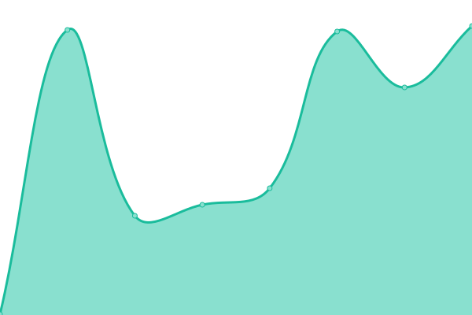
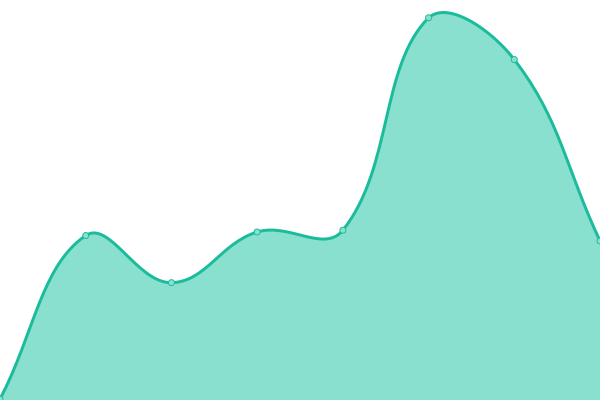
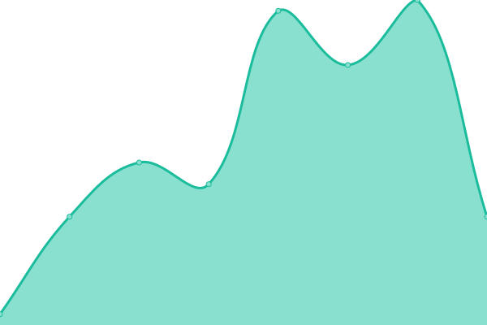

# [📈 Live Status](https://Kitki30.github.io/status-page): <!--live status--> **🟥 Complete outage**

This repository contains the open-source uptime monitor and status page for [Kitki30](https://www.kitki30.tk), powered by [Upptime](https://github.com/upptime/upptime).

With [Upptime](https://upptime.js.org), you can get your own unlimited and free uptime monitor and status page, powered entirely by a GitHub repository. We use [Issues](https://github.com/Kitki30/status-page/issues) as incident reports, [Actions](https://github.com/Kitki30/status-page/actions) as uptime monitors, and [Pages](https://Kitki30.github.io/status-page) for the status page.

<!--start: status pages-->
<!-- This summary is generated by Upptime (https://github.com/upptime/upptime) -->
<!-- Do not edit this manually, your changes will be overwritten -->
<!-- prettier-ignore -->
| URL | Status | History | Response Time | Uptime |
| --- | ------ | ------- | ------------- | ------ |
|  [Our servers](https://api.kitki30.tk/ip) | 🟥 Down | [our-servers.yml](https://github.com/Kitki30/status-page/commits/HEAD/history/our-servers.yml) | 

 317ms
     
 | 

<a href="https://Kitki30.github.io/status-page/history/our-servers">0.00%</a>
    

|  [Redirector](https://kitki30.tk/) | 🟥 Down | [redirector.yml](https://github.com/Kitki30/status-page/commits/HEAD/history/redirector.yml) | 

 350ms
     
 | 

<a href="https://Kitki30.github.io/status-page/history/redirector">0.00%</a>
    

|  [Api](https://api.kitki30.tk/) | 🟥 Down | [api.yml](https://github.com/Kitki30/status-page/commits/HEAD/history/api.yml) | 

 29ms
     
 | 

<a href="https://Kitki30.github.io/status-page/history/api">0.00%</a>
    

<!--end: status pages-->

[**Visit our status website →**](https://Kitki30.github.io/status-page)

## 📄 License

- Powered by: [Upptime](https://github.com/upptime/upptime)
- Code: [MIT](./LICENSE) © [Anand Chowdhary](https://anandchowdhary.com), supported by [Pabio](https://pabio.com)
- Data in the `./history` directory: [Open Database License](https://opendatacommons.org/licenses/odbl/1-0/)
